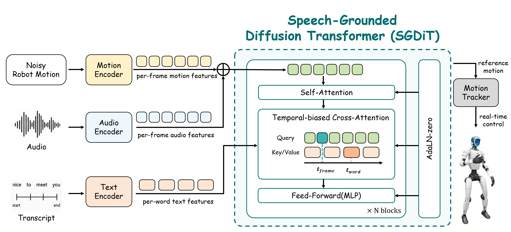

# ECHO-G

**Embodied Co-speech Humanoid mOtion Generation**

ECHO-G generates full-body, robot-space co-speech motion from an utterance's audio and
word-timed transcript. Its Speech-Grounded Diffusion Transformer (SGDiT) combines frame-level
acoustic features with token-level linguistic features and learns a conditional robot-motion
distribution with rectified flow matching.



This repository is the minimal research release of the main ECHO-G pipeline:

- direct generation of physical robot reference states;
- sinusoidal temporal position encoding for variable-length motion;
- word-timed cross-attention;
- rectified-flow training with temporal velocity regularization;
- EMA checkpoints and deterministic Euler sampling;
- optional extraction of acoustic and linguistic conditioning features.

It intentionally excludes the embodiment-transfer VAE, Wan experiments, learned position
embeddings, retargeting utilities, robot control code, and internal cluster configuration.

## Installation

Python 3.10 or 3.11 and PyTorch 2.1 or newer are supported.

```bash
cd ECHO-G
python -m venv .venv
source .venv/bin/activate
pip install -e .
```

Install condition-extraction dependencies only when raw audio and transcripts must be encoded:

```bash
pip install -e ".[preprocess]"
```

For development and tests:

```bash
pip install -e ".[dev]"
pytest
ruff check .
```

## Dataset Interface

The processed dataset is distributed separately because its source speech, motion, and robot
assets have their own licenses. ECHO-G expects the following layout:

```text
DATA_ROOT/
|-- condition_30fps/       # one <stem>.pt per utterance
|-- motion_39d_30fps/      # one <stem>.pt per utterance
|-- splits/
|   |-- train_all.txt
|   `-- val_common.txt
|-- stats/
|   `-- all_train.pt
`-- audit/condition/
    `-- per_clip_condition_motion_audit.csv
```

Each motion file contains an unnormalized physical `robot_repr` tensor. Each condition file
contains frame-aligned acoustic features, transcript-token features, and optional token time
intervals. See [docs/DATA_FORMAT.md](docs/DATA_FORMAT.md) for the complete contract.

Validate a release before training:

```bash
echo-g-validate-data \
  --config configs/sgdit_sinusoidal.yaml \
  --data-root /path/to/echo_g_data
```

## Training

The checked-in configuration is the paper configuration for direct robot-space SGDiT:

```bash
echo-g-train \
  --config configs/sgdit_sinusoidal.yaml \
  --data-root /path/to/echo_g_data \
  --output-dir outputs/sgdit_sinusoidal \
  --device cuda
```

Resume an interrupted run from its full training checkpoint:

```bash
echo-g-train \
  --config configs/sgdit_sinusoidal.yaml \
  --data-root /path/to/echo_g_data \
  --output-dir outputs/sgdit_sinusoidal \
  --resume outputs/sgdit_sinusoidal/latest.pt \
  --device cuda
```

The output directory contains:

```text
experiment.json   frozen configuration and data hashes
latest.pt         full resume state
best.pt           best EMA inference checkpoint
final.pt          final EMA inference checkpoint
complete.json     completion marker
```

## Sampling

Generate and denormalize robot references for the validation split:

```bash
echo-g-sample \
  --checkpoint outputs/sgdit_sinusoidal/best.pt \
  --data-root /path/to/echo_g_data \
  --output-dir outputs/sgdit_sinusoidal/predictions \
  --split val \
  --seeds 0 \
  --device cuda
```

Prediction files contain physical robot references at the dataset frame rate. Sampling noise is
derived from the utterance stem and requested seed, so results do not depend on DataLoader order.

The sampler also accepts the original paper checkpoint format. Pass
`--config configs/sgdit_sinusoidal.yaml` when using such a checkpoint.

## Extracting Conditions

Condition extraction consumes a JSON Lines manifest. Each row contains a stable stem, an audio
path, a transcript, and optional word timing:

```json
{"stem":"example_0001","audio_path":"audio/example.wav","transcript":"Hello world","words":[{"text":"Hello","start":0.10,"end":0.42},{"text":"world","start":0.55,"end":0.91}]}
```

Run the frozen speech and language encoders separately, then merge their outputs:

```bash
echo-g-extract-conditions \
  --mode audio --manifest utterances.jsonl \
  --output-dir data/condition_30fps \
  --audio-model /path/or/model-id/wav2vec2-large-xlsr-53-english \
  --fps 30 --device cuda

echo-g-extract-conditions \
  --mode text --manifest utterances.jsonl \
  --output-dir data/condition_30fps \
  --text-model /path/or/model-id/Qwen3.5-4B \
  --text-layer -2 --max-text-tokens 64 --device cuda

echo-g-extract-conditions \
  --mode merge --manifest utterances.jsonl \
  --output-dir data/condition_30fps
```

For exact paper reproduction, use the separately distributed frozen condition files; this avoids
encoder-version and audio-decoder differences. The extraction command is provided for new data and
deployment inputs.

## Reproducibility

The release records split and statistics hashes inside every checkpoint. FP32 training, TF32
disablement, the optimizer schedule, gradient accumulation, EMA, and random seed are fixed by the
configuration. Exact paper-release hashes and reference values are listed in
[docs/REPRODUCIBILITY.md](docs/REPRODUCIBILITY.md).

## Project Layout

```text
configs/                 paper training configuration
src/echo_g/config.py     validated configuration schema
src/echo_g/data.py       paired variable-length dataset and batching
src/echo_g/model.py      SGDiT and word-timed cross-attention
src/echo_g/flow.py       rectified-flow objective and Euler sampler
src/echo_g/training.py   training, EMA, validation, and resume checkpoints
src/echo_g/inference.py  deterministic physical-unit export
src/echo_g/conditions.py frozen-encoder feature extraction
tests/                   CPU unit and end-to-end smoke tests
```

## License

The source is available under the
[PolyForm Noncommercial License 1.0.0](LICENSE). Commercial use requires written permission from
the contacts listed in [NOTICE](NOTICE). This is a noncommercial research-code release and is not
an OSI-approved open-source license.

## Citation

Citation metadata is provided in [CITATION.cff](CITATION.cff).
